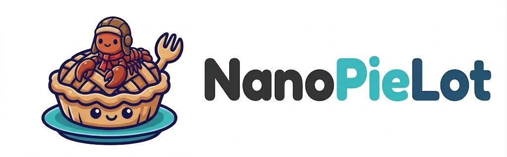

<p align="center">
  
</p>

<p align="center">
  <em>Easy as Pie.</em><br>
  <a href="https://github.com/trsdn/nanoclaw">NanoClaw</a>, ported to the GitHub Copilot SDK — same claw, different cockpit. 🥧🧑‍✈️
</p>

---

## What Changed from NanoClaw

NanoPieLot is a full port of [NanoClaw](https://github.com/trsdn/nanoclaw) from Anthropic/Claude to the GitHub Copilot SDK:

- **Any Copilot model.** `/model list` to see what's available, `/model <id>` to switch. GPT-4.1, Claude, Gemini — whatever your GitHub plan gives you.
- **Same architecture.** Everything else works exactly like [NanoClaw](https://github.com/trsdn/nanoclaw): containers, channels, skills, groups, scheduling.
- Authentication via `copilot login` device flow.

## Quick Start

```bash
gh repo fork trsdn/nanopielot --clone
cd nanopielot
copilot
```

Then run `/setup`.

> Commands prefixed with `/` (like `/setup`, `/add-whatsapp`) are CLI agent skills. Type them inside the `copilot` prompt, not in your regular terminal.

## Requirements

- macOS, Linux, or Windows (via WSL2)
- Node.js 20+
- GitHub Copilot CLI
- Apple Container (macOS) or Docker (macOS/Linux)

## Architecture

```
Channels → SQLite → Polling loop → Container (GitHub Copilot SDK) → Response
```

Single Node.js process. Channels self-register at startup. Agents run in isolated Linux containers. Per-group message queue with concurrency control.

## Special Thanks

NanoPieLot wouldn't exist without [NanoClaw](https://github.com/qwibitai/nanoclaw). The original project's philosophy, architecture, and skill system are the foundation of everything here. We just swapped the engine. 🥧

## License

MIT — see [LICENSE](LICENSE)
