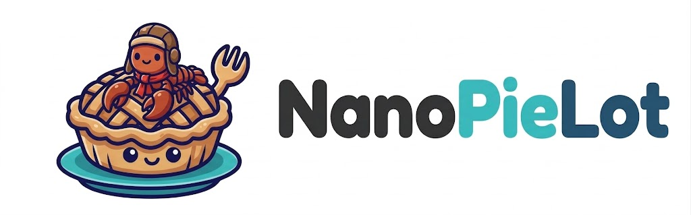

<p align="center">
  
</p>

<h3 align="center">🥧 Easy as Pie.</h3>

<p align="center">
  <a href="https://github.com/qwibitai/nanoclaw">NanoClaw</a>, ported to the GitHub Copilot SDK — same claw, different cockpit. 🧑‍✈️
</p>

<p align="center">
  <a href="LICENSE"></a>
  <a href="package.json"></a>
  <a href="https://github.com/trsdn/nanopielot/actions/workflows/ci.yml"></a>
  <a href="https://github.com/trsdn/nanopielot/releases/latest"></a>
  <a href="docs/conformance.md"></a>
</p>

<p align="center">
  
</p>

---

**Status:** actively maintained, best-effort, as a personal project of
[@trsdn](https://github.com/trsdn). It is for a developer comfortable forking a
repository, running Docker or Apple Container, and authenticating the GitHub
Copilot CLI — not a packaged app a non-developer installs by name.

**Language:** this project's interface, documentation, and source are English
only; no localized builds are published.

## What Changed from NanoClaw

NanoPieLot is a full port of [NanoClaw](https://github.com/qwibitai/nanoclaw) from Anthropic/Claude to the GitHub Copilot SDK:

- **Any Copilot model.** `/model list` to see what's available, `/model <id>` to switch. GPT-4.1, Claude, Gemini — whatever your GitHub plan gives you.
- **Same architecture.** Everything else works exactly like [NanoClaw](https://github.com/qwibitai/nanoclaw): containers, channels, skills, groups, scheduling.
- Authentication via `copilot login` device flow.

## Quick Start

```bash
gh repo fork trsdn/nanopielot --clone
cd nanopielot
copilot
```

Then run `/setup`.

> Commands prefixed with `/` (like `/setup`, `/add-whatsapp`) are CLI agent skills. Type them inside the `copilot` prompt, not in your regular terminal.

## Requirements

- macOS, Linux, or Windows (via WSL2)
- Node.js 20+
- GitHub Copilot CLI
- Apple Container (macOS) or Docker (macOS/Linux)

## Migration from NanoClaw

If you are migrating an existing NanoClaw setup or maintaining a fork, read the NanoPieLot-specific migration notes in [docs/MIGRATION.md](docs/MIGRATION.md).

## Troubleshooting

For common NanoPieLot-specific deployment and runtime problems, see [docs/TROUBLESHOOTING.md](docs/TROUBLESHOOTING.md).

## Architecture

```
Channels → SQLite → Polling loop → Container (GitHub Copilot SDK) → Response
```

Single Node.js process. Channels self-register at startup. Agents run in isolated Linux containers. Per-group message queue with concurrency control.

## Data and privacy

NanoPieLot runs on infrastructure you provide and control; this project itself
collects nothing.

| Question | Answer |
|---|---|
| What is collected | Nothing by this project: no telemetry, no analytics, no crash reporting. |
| Where data goes | The channels you enable (WhatsApp, Telegram, Slack, Discord, Gmail) and the GitHub Copilot API, which your agent containers call to respond. No other outbound destination. |
| Who receives your content | GitHub (via the Copilot SDK/API) and whichever chat platforms you connect. Their own terms and privacy policies govern what they do with it. |
| What is stored locally | Conversation and group state in SQLite (`src/db.ts`), per-group memory under `groups/`, and the Copilot device-login session under `data/copilot-auth/`. All on the machine you run it on. |
| Retention | Kept until you delete the data directory or the group; nothing is sent anywhere for retention beyond the platforms above. |

## Accessibility

NanoPieLot has no graphical interface of its own; every surface is either a
chat platform's own client (WhatsApp, Telegram, Slack, Discord, Gmail — their
accessibility, not this project's) or plain-text console/log output during
setup and debugging, which uses no colour-only signalling.

## Security and support

Report a vulnerability privately through GitHub's [private vulnerability
reporting](https://github.com/trsdn/nanopielot/security/advisories/new). Ask
for help by opening an issue with the `/debug` skill's output; see
[docs/TROUBLESHOOTING.md](docs/TROUBLESHOOTING.md) first.

## Contributing Workflow

For issue-driven work, create a dedicated branch and merge via pull request. Avoid developing feature or issue work directly on `main`.

## Special Thanks

NanoPieLot wouldn't exist without [NanoClaw](https://github.com/qwibitai/nanoclaw). The original project's philosophy, architecture, and skill system are the foundation of everything here. We just swapped the engine. 🥧

Forked from upstream commit [`a3fb3be`](https://github.com/qwibitai/nanoclaw/commit/a3fb3beb6ac28757e0a3dbe3b64862cd4839f8ce) (2026-03-28).

## License

MIT — see [LICENSE](LICENSE)
